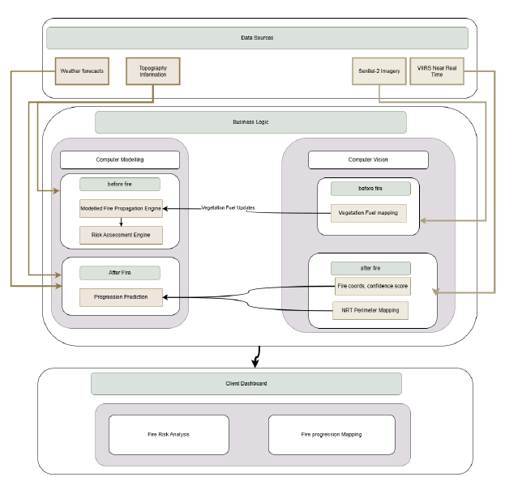
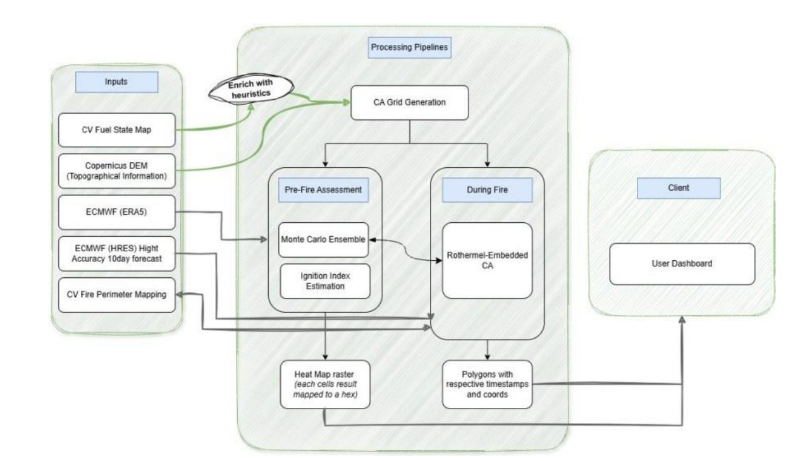

### WRaP CA Engine


### Project Identity

```
Language: Java 21 (Temurin 21.0.10)
Framework: Spring Boot 4.0.3
Build: Maven
Base package: com.victorkithinji.wrap.wrapca
Project name: WrapCa
```

> **[!IMPORTANT]**:  
> _Consider going through the following documents to better understand the project_
> 
> : [`Documentation`](https://github.com/VictorCodebase/wrapca/blob/5f11456315dd6eefd8f50423e133484a84addfef/docs/Wildfire%20Risk%20and%20Progression%20Modelling%20Documentation.pdf) (not opening? look at 
> ./docs/)  
> : [`SRD` (Software Requirements and Design)](https://docs.google.com/document/d/11iYsi2c2p8eT4DeZwPl7QybqKE4Uoj_q/edit?usp=sharing&ouid=105294404014185386116&rtpof=true&sd=true) (ctrl + click to open doc on new tab)


---

### What this system is

WRaP is a two-phase wildfire CA engine exposed as a Spring Boot REST API. A Chromium frontend consumes the API — all
computation is Java-side.

This is part of the Wildfire Risk and Progression Modelling project with the repositories:

| Name | Stack | Desciption                                                                                                            |
|------|-------|-----------------------------------------------------------------------------------------------------------------------|
|Wrap Ca Engine| Java 21, Springboot | (This repo) This is the solution's backend                                                                            |
| Wrap UI | ReactJS, Vite | [Repository Link] (https://github.com/VictorCodebase/wrap-ui). This offers an interactive Chromium UI for the backend |


Wrap CA operates in two phases:

**Phase 1 (pre-fire):** Monte Carlo ensemble of CA runs to produce two output layers — ignition probability map (
smoothed I(c) index) and damage potential map (burn frequency across N runs).

**Phase 2 (active fire):** Rothermel-embedded CA spread simulation. CV corrections injected at each satellite overpass
to prevent error compounding.

The CA grid is a 2D array of 100m cells. Each cell holds a state (UNBURNED / BURNING / BURNED / NON_COMBUSTIBLE) and an
environment vector (NDVI, NDMI, slope, aspect, vegetation type). Only cells with at least one BURNING neighbour are
evaluated per generation — this is the core efficiency constraint.

---


_these images have been fetched from the official documentation.
Click [Documentation](docs/Wildfire%20Risk%20and%20Progression%20Modelling%20Documentation.pdf) to open the full documentation_
> Overall architecture


> WrapCa architecture



### Project
The project is broken into the following modular sections
```
api/            → HTTP only, no logic
facade/         → startup orchestration, mode detection
grid/           → CA grid domain objects
ingestion/      → GeoTIFF reading, wind loading, ESA reading,
                  road geometry loading, data cache
rothermel/      → pure fire physics, no Spring dependencies
simulation/     → CA engine, Moore neighbourhood, active frontier
montecarlo/     → Phase 1 ensemble runner
correction/     → CV re-injection, suppressed zone tracking
output/         → result assembly, perimeter extraction
history/        → JSON run persistence
dto/            → API request/response shapes only
config/         → reads application.properties into typed beans
cvintegration/  → HTTP client to CV module, mode detection boundary
```

The modules' dependency on each other is listed below, modules listed in a group exist largely independent of 
each other, however modules lower in the list are largely dependent on those higher in the list. This grouping is what 
informs this project's CI.

| Group | Packages | Why grouped |
|-------|----------|--------|
| 1     | grid, rothermel | Pure Java, zero Spring, fastest, foundational |
| 2     | config | Spring context must bind before anything else runs |
| 3     | ingestion, cvintegration | External data boundary, both I/O-heavy |
| 4     |grid (init), simulation | The CA engine core |
| 5     | montecarlo, correction | Both consume the engine, independent of each other |
| 6     | output, history, dto | Pure transformation/serialization, no simulation logic |
| 7     | 	facade, api | Full wiring — this is where CORS and REST/JSON actually get exercised |

---

### application.properties 

```properties
spring.application.name=WrapCa
server.port=8080
wrap.data.root=./data
wrap.simulation.cell-size-metres=100
wrap.simulation.time-step-minutes=5
wrap.simulation.monte-carlo-runs=200
wrap.simulation.thread-pool-size=8
wrap.simulation.phase1-horizon-hours=24
wrap.cv.geotiff-path=./data/geotiff/latest_cv_output.tif
wrap.cv.base-url=http://localhost:5000/api/cv
wrap.cv.stub-mode=true
wrap.data.esa-path=./data/esa/esa_worldcover.tif
wrap.data.roads-path=./data/osm/roads.geojson
```

---

### Implementation order

This project is implemented in the sequence below. Each group depends on the previous.

---

#### GROUP 1 — Domain foundation (no Spring, pure Java)

*These have zero dependencies on anything else in the project.*

**1. `grid/CellState.java`**
Enum: `UNBURNED, BURNING, BURNED, NON_COMBUSTIBLE`

**2. `grid/CellEnvironment.java`**
Data class (Lombok `@Value` — immutable). Fields: `float ndvi, ndmi, slopeRadians, aspectRadians` and a `VegetationType`
enum reference. This is the static per-cell environmental vector assigned at grid init and refreshed by CV correction.

**3. `grid/VegetationType.java`**
Enum: `AFROMONTANE_FOREST, GRASSLAND, SHRUBLAND, BARE_SOIL, WATER, BUILT, CROPLAND`. Note: `GRASSLAND` (not
`MONTANE_GRASSLAND` — see DEV-003). `CROPLAND` is appended last (see DEV-004). Do not reorder constants — ordinal
stability is required for API responses. `WATER` and `BUILT` are non-combustible. `CROPLAND` uses grassland-equivalent
fuel parameters. All combustible types must have a matching entry in `east_africa_fuel_models.json`.

**4. `grid/CaGrid.java`**
Holds: `int[][] states` (using CellState ordinals for speed), `CellEnvironment[][] environment`, `int rows`, `int cols`,
`double cellSizeMetres`. No Spring annotations. This object is the simulation's entire spatial state.

---

#### GROUP 2 — Fire physics (no Spring, pure Java, independently testable)

*Implement and unit test these against known Rothermel values before touching the engine.*

**5. `rothermel/FuelModelResolver.java`**
Maps `VegetationType` → fuel parameters (load, moisture of extinction, heat content, SAV ratio). Values come from
`fuelmodels/east_africa_fuel_models.json` in resources. Must include entries for all combustible types including
`CROPLAND` (grassland-equivalent values). Keep a static lookup — no database, no complexity.

**6. `rothermel/WindProjectionCalculator.java`**
Given a wind vector (speed + direction in degrees) and a Moore direction index (0–7), returns the effective wind
component Ue along that direction. Negative projections clamped to zero.

**7. `rothermel/SlopeEffectCalculator.java`**
Given elevation of source cell and target cell plus distance, returns slope angle φs. Distance is `cellSize` for
cardinal directions, `cellSize × √2` for diagonals.

**8. `rothermel/RothermelRosCalculator.java`**
Pure static methods. Takes fuel params, Ue, φs → returns ROS in metres per minute. This is the simplified Rothermel (
1972) surface fire formula. No Spring annotations. Validate against Andrews (2018) reference values before proceeding to
Group 3.

---

#### GROUP 3 — Configuration (Spring, simple)

**9. `config/SimulationConfig.java`**
`@Configuration @ConfigurationProperties(prefix = "wrap.simulation")`. Lombok `@Data`. Fields: `cellSizeMetres`,
`timeStepMinutes`, `monteCarloRuns`, `threadPoolSize`, `phase1HorizonHours`.

**10. `config/CorsConfig.java`**
`@Configuration`. Permits localhost origins during development. One method, ~10 lines.

---

#### GROUP 4 — Ingestion (Spring services, external data boundary)

**11. `ingestion/IngestionCacheService.java`**
Checks `data/cache/` for a file matching today's date before triggering a re-fetch of the CV fuel state GeoTIFF. Returns
`Optional<Path>` for the CV fuel state. Also exposes existence-only cache methods for ESA and road layers:
`getCachedEsaLayer()`, `storeEsaLayer(byte[])`, `getCachedRoadLayer()`, `storeRoadLayer(String)`. ESA and road caches
never expire — these files do not change on a regular schedule. Existing CV fuel state methods check by date as before.

**12. `ingestion/GeoTiffBandReaderService.java`**
Two read methods. `read(Path tiffPath)` reads the CV fuel state GeoTIFF — extracts 5 bands from an 11-band file: NDVI (
index 5), NDMI (6), elevation (8), slope (9), aspect (10). Band selection governed by `BandLayout` constants class
internal to this package. Returns `GridBands` at native 10m resolution. `readEsa(Path esaTiffPath)` reads the ESA
WorldCover GeoTIFF and returns `EsaBands` holding `int[][] classCode` and spatial metadata. Band indices and ESA class
code mappings are in `EsaBandLayout` constants class internal to this package. CRS confirmed EPSG:32737. Native pixel
size confirmed 10m.

**13. `ingestion/WindFieldLoaderService.java`**
Loads ERA5 wind data from a local stub file. Interpolates to CA grid resolution. Returns a `WindField` object: two
`float[][]` arrays for speed and direction per cell. Pass post-resampling rows and cols so WindField dimensions match
the CA grid.

**14. `ingestion/FirePerimeterParserService.java`**
Parses a CV-provided fire perimeter GeoJSON polygon into a `Set<Long>` of encoded cell indices (
`row * gridWidth + col`). This is the initial BURNING cell set for Phase 2.

**15. `ingestion/OsmRoadLoaderService.java`**
`@Service`. Reads a pre-downloaded GeoJSON file from `wrap.data.roads-path`. Parses road and path linestring geometry (
highway tags: track, path, unclassified, tertiary) into a `RoadLayer` object holding `List<long[][]>` of UTM 37S
linestring coordinates. Does not call any external API at runtime — the GeoJSON file is downloaded once and stored
locally. If the file is missing, logs a warning and returns an empty `RoadLayer`; the simulation proceeds with zero road
proximity influence on I(c).

---

#### GROUP 4.5 — CV Integration

**16. `cvintegration/FirePerimeterData.java`**
Data class first — no dependencies. Fields: `String perimeterGeoJson`, `List<Long> confirmedBurnedCellIndices`,
`List<Long> suppressedZoneCellIndices`, `Map<Long, Float> updatedMoistureValues`, `Instant observationTime`. Any field
may be null or empty — all consumers must handle this without throwing. Empty `suppressedZoneCellIndices` is a valid and
expected case.

**17. `cvintegration/CvApiClient.java`**
`@Service`. Wraps Spring `RestClient`. Two methods: `fetchLatestFuelState()` → `Optional<Path>` (downloads GeoTIFF to
local cache via `IngestionCacheService`), `fetchLatestFirePerimeter()` → `Optional<FirePerimeterData>` (returns empty
when CV returns 404 — this is the fire/no-fire signal). Both methods return `Optional.empty()` silently when
`wrap.cv.stub-mode=true`. Neither method throws — all HTTP failures caught and logged as warnings. Properties consumed:
`wrap.cv.base-url`, `wrap.cv.stub-mode`.

---

#### GROUP 5 — Grid initialisation (Spring services)

**18. `ingestion/RasterResamplerService.java`**
Two resampling paths. Continuous bands path: accepts `GridBands` at native resolution and target cell size from
`SimulationConfig`, returns new `GridBands` at target resolution using block-averaging across all five bands (NDVI,
NDMI, elevation, slope, aspect). Categorical path: accepts `EsaBands` and target cell size, returns resampled `int[][]`
class codes using majority-class resampling. Tie-breaking rule: prefer combustible ESA class over non-combustible.

**19. `grid/GridInitialiserService.java`**
Receives three inputs: resampled `GridBands` (from `RasterResamplerService`), resampled ESA `int[][]` class codes (from
`RasterResamplerService`), and `RoadLayer` (from `OsmRoadLoaderService`). Resolves ESA class codes to `VegetationType`
per cell using `EsaBandLayout` mappings — does not infer vegetation type from NDVI thresholds. Marks `NON_COMBUSTIBLE`
for `WATER` (ESA code 80) and `BUILT` (ESA code 50). Does not derive slope or aspect from elevation — CV provides both
directly. Computes `float[][] roadProximityMetres` — minimum distance from each cell centre to nearest road segment in
`RoadLayer` — and retains it for handoff to `IgnitionLikelihoodIndexBuilder` in Group 7.

---

#### GROUP 6 — Simulation engine (Spring services)

**20. `correction/SuppressedZoneRegistry.java`**
Build here, before the engine, because `CaSpreadEngine` depends on it. `@Service`. Holds `Map<Long, Instant>` of cell
index → suppression expiry time. Methods: `register(long, Instant)`, `registerAll(Iterable<Long>, Instant)`,
`isActive(long)` (lazy expiry removal on read), `clear()`, `size()`. Empty suppressed zone list is fully valid —
`isActive()` returns false for all cells when registry is empty. This is the expected state when CV does not report
suppression data.

**21. `simulation/ActiveCellFrontierTracker.java`**
Maintains a `HashSet<Long>` of cells that have at least one BURNING neighbour. Updated each generation — cells added
when a neighbour ignites, removed when they become BURNED or all neighbours are BURNED.

**22. `simulation/IgnitionProbabilityResolver.java`**
For one target cell, iterates its BURNING neighbours, calls `RothermelRosCalculator` for each, computes Pₑ per
neighbour, resolves combined ignition probability: `1 - ∏(1 - Pₑⱼ)`. Returns a double.

**23. `simulation/MooreNeighbourEvaluator.java`**
For a given cell coordinate, returns the 8 Moore neighbours with their direction indices and distances. Handles grid
boundary checks.

**24. `simulation/SimulationStepResult.java`**
Data class (Lombok `@Value`). Fields: `Set<Long> newlyBurnedCells`, `int generation`, `Instant timestamp`.

**25. `simulation/CaSpreadEngine.java`**
The core engine. Per generation: iterates frontier cells via `ActiveCellFrontierTracker`, checks
`SuppressedZoneRegistry` before evaluating any cell, calls `IgnitionProbabilityResolver`, resolves state transitions
stochastically, updates grid, updates frontier, produces `SimulationStepResult`. Takes `CaGrid` + `WindField` as inputs.
Used by both Phase 1 (Monte Carlo) and Phase 2 (active spread).

---

#### GROUP 7 — Monte Carlo ensemble (Spring services)

**26. `montecarlo/IgnitionLikelihoodIndexBuilder.java`**
Computes I(c) per cell: weighted combination of normalised NDMI, historical FIRMS fire density, and road proximity.
Human activity proximity input is `roadProximityMetres` array passed from `GridInitialiserService` — not derived from
OSM at this stage. Output is a `float[]` probability weight array used for seeding. Runs once before ensemble.

**27. `montecarlo/IgnitionSeedSampler.java`**
Samples N ignition seed cells from the grid with probability proportional to I(c). Uses Commons Math for weighted
sampling. Returns `List<Long>` of encoded cell indices.

**28. `montecarlo/BurnFrequencyAccumulator.java`**
Thread-safe accumulation of burn counts across N parallel runs. Uses `AtomicIntegerArray` sized `rows × cols`.

**29. `montecarlo/MonteCarloEnsembleRunner.java`**
Spawns N independent `CaSpreadEngine` instances via `ForkJoinPool`. Each run gets its own deep copy of `CaGrid` and a
single ignition seed. Aggregates into `BurnFrequencyAccumulator`. Each task is fully independent — no shared mutable
state between runs.

**30. `montecarlo/RiskMapAssembler.java`**
Converts `BurnFrequencyAccumulator` counts → normalised damage potential values per cell. Combines with smoothed I(c) to
produce the dual-layer Phase 1 output.

---

#### GROUP 8 — CV correction (Spring services)

**31. `correction/CvStateInjectorService.java`**
Applies CV observation layer to a running `CaGrid` in fixed order: (1) force confirmed BURNED cells, (2) register
suppressed zones in `SuppressedZoneRegistry` and force those cells to `NON_COMBUSTIBLE`, (3) refresh NDMI for UNBURNED
cells only. Steps 2 and 3 are skipped cleanly if their respective lists are empty or null — this is the normal case when
CV does not report suppression data.

---

#### GROUP 9 — Output assembly

**32. `output/SimulationResultAssembler.java`**
Converts `CaGrid` state + `List<SimulationStepResult>` → response DTOs. Populates `vegetationTypeOrdinals` in
`PhaseOneResultResponse` by iterating `CaGrid.environment` and extracting `vegetationType.ordinal()` per cell. Produces
compact JSON-friendly structures. Does not send GeoTIFF bytes over API.

**33. `output/PerimeterPolygonExtractor.java`**
Traces boundary between BURNED/BURNING and UNBURNED cells → GeoJSON polygon with timestamp.

**34. `output/HeatmapRasterWriter.java`**
Writes Phase 1 risk maps to GeoTIFF for file export only. Not called during normal API responses.

---

#### GROUP 10 — History persistence (JSON files)

**35. `history/RunRecord.java`**
Lombok `@Value`. Fields:
`String runId, SimulationPhase phase, Instant startedAt, Instant completedAt, Map<String,Object> parameters, String resultFilePath`.

**36. `history/RunLogWriterService.java`**
Serialises `RunRecord` to `data/runs/{timestamp}_{phase}.json` on simulation completion. No database.

**37. `history/RunLogReaderService.java`**
Lists `data/runs/`, deserialises each file, returns `List<RunRecord>` sorted by date.

---

#### GROUP 11 — DTOs

**38. `dto/request/PhaseOneRunRequest.java`**
No required fields. Optional wind speed/direction overrides for scenario testing.

**39. `dto/request/PhaseTwoRunRequest.java`**
Fields: `boolean cvDisabled`, `boolean manualIgnition`, `String manualIgnitionPolygonGeoJson` (nullable),
`int simulationHours`.

**40. `dto/request/CvCorrectionRequest.java`**
Fields: `String observedPerimeterGeoJson`, `List<String> suppressedZoneCellIds`,
`Map<String,Float> updatedMoistureValues`.

**41. `dto/response/SessionStatusResponse.java`**
Fields: `SimulationMode mode` (PRE_FIRE / ACTIVE_FIRE), grid summary (rows, cols, cellSize, bounds),
`List<RunSummaryResponse> pastRuns`.

**42. `dto/response/PhaseOneResultResponse.java`**
Fields: `String runId`, `float[] damagePotentialValues`, `float[] ignitionProbabilityValues`,
`int[] vegetationTypeOrdinals`, `int rows`, `int cols`. All three arrays are the same length (rows × cols).
`vegetationTypeOrdinals` values are `VegetationType` enum ordinals.

**43. `dto/response/PhaseTwoResultResponse.java`**
Fields: `String runId`, `List<PerimeterSnapshot> perimetersByTimestamp` where each snapshot holds a GeoJSON polygon
string and an ISO timestamp.

---

#### GROUP 12 — Facade and API (wire everything together last)

**44. `facade/WrapSessionFacade.java`**
`@Service`. Startup sequence: checks cache → loads CV GeoTIFF via `CvApiClient` → loads ESA layer via
`GeoTiffBandReaderService.readEsa()` → loads road layer via `OsmRoadLoaderService` → resamples via
`RasterResamplerService` → initialises grid via `GridInitialiserService` → checks for fire perimeter via
`CvApiClient.fetchLatestFirePerimeter()` → sets mode. Three CV poll triggers: (1) server startup, (2) manual via
`POST /api/session/refresh`, (3) scheduled every 3 hours via `@Scheduled`. Mode detection: perimeter present →
`ACTIVE_FIRE`, empty → `PRE_FIRE`. `manualIgnition=true` in request bypasses CV perimeter check entirely.

**45. `api/GridController.java`**
`@RestController`. Endpoints: `GET /api/session/status`, `POST /api/session/refresh`.

**46. `api/SimulationController.java`**
`@RestController`. Endpoints: `POST /api/simulation/phase-one/run`, `POST /api/simulation/phase-two/run`,
`POST /api/simulation/phase-two/correct`.

**47. `api/RunHistoryController.java`**
`@RestController`. Endpoints: `GET /api/runs`, `GET /api/runs/{runId}`.

---

### Key implementation constraints to preserve

- `RothermelRosCalculator` — static methods only, zero Spring annotations, unit test in isolation first
- Cell coordinates encoded as `long = row * gridWidth + col` everywhere — never use `int[]` as map keys
- Monte Carlo runs — each task owns a full deep copy of `CaGrid`, `AtomicIntegerArray` for accumulation
- CV corrections are hard state overrides, not probabilistic adjustments
- Empty `suppressedZoneCellIndices` from CV is valid and expected — `SuppressedZoneRegistry` handles it without error
- API responses never contain raw grid arrays or GeoTIFF bytes — always compact numeric structures
- `GeoTiffBandReaderService` reads exactly 5 bands from the 11-band CV file — band indices are constants in
  `BandLayout`, single file to update if CV changes its layout. CRS: EPSG:32737, native pixel size: 10m
- ESA WorldCover class codes mapped to `VegetationType` via `EsaBandLayout` — single source of truth for that mapping
- Road geometry loaded from pre-downloaded GeoJSON at `wrap.data.roads-path` — no runtime OSM API calls
- Run history: flat JSON files in `data/runs/`, no database
- `VegetationType` ordinal order is fixed — do not reorder enum constants
